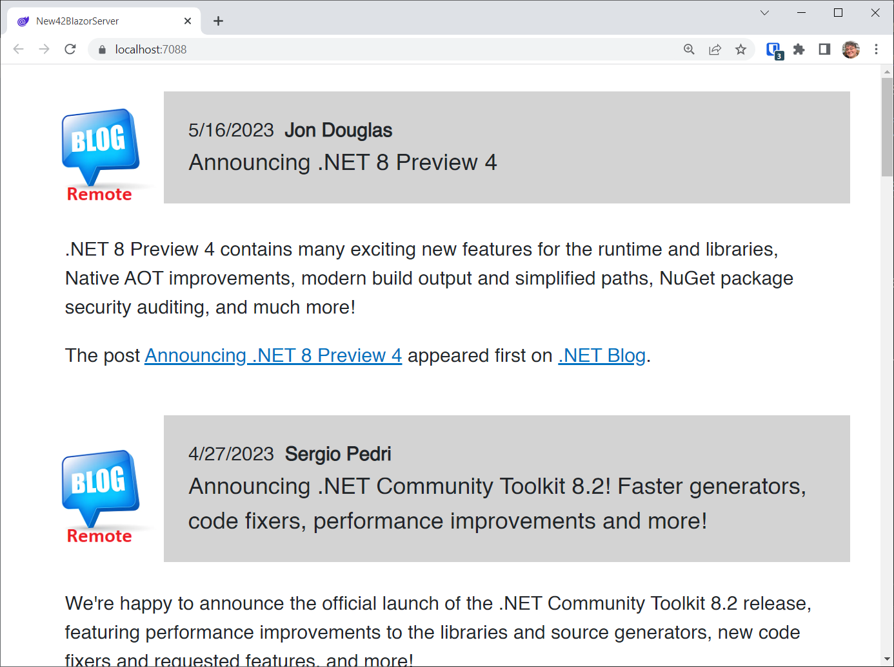

# Blazor is the New 42

Source code and documentation for [BlazorTrain episode 97](https://youtu.be/bFjMtotglbk), in which I make the case that [Blazor](https://dotnet.microsoft.com/en-us/apps/aspnet/web-apps/blazor) is the best choice for a ubiquitous user interface framework, not only because of productivity but consistency of experience from platform to platform. Blazor is open-source, as it is part of the OSS [.NET Framework](https://dotnet.microsoft.com/en-us/).

First of all, anyone who's read or even heard of the iconic 1979 novel, "[The Hitch Hiker's Guide to the Galaxy](https://en.wikipedia.org/wiki/The_Hitchhiker%27s_Guide_to_the_Galaxy)" by Douglas Adams, knows that 42 is the answer to everything. Well, move over 42, Blazor is taking your place, at least as far as UI Frameworks go. 

Sure, you could argue that the combination of html, css, and javascript is the ultimate cross-platform ui stack. You CAN do anything with it, but being productive is still hard without additional frameworks, and there are many. 

[Angular](https://angular.io/) was the front-runner for years, and now [React](https://legacy.reactjs.org/) is out front, with Angular in second place, and [Vue](https://vuejs.org/) coming in third. I've been following (and using) Blazor since it's inception. It started out as a web UI framework, but alert developers noticed another feature: The [Blazor Component Model](https://learn.microsoft.com/en-us/aspnet/core/blazor/components/?view=aspnetcore-7.0). 

The simplicity of Blazor's binding features (for example) runs rings around the ceremony required by some of these JavaScript frameworks. Oh, and by the way, you can write most of your code in C#. Today Blazor can be used to develop apps on any platform, and (this is the important part) the Blazor UI is consistent from platform to platform. 

In this module, I'll write a simple Blazor app and run it as a web app in the browser. Then, I'll run it on my iPhone, then my Android phone, then as a a Mac desktop app, as a Windows Forms app, and finally as a WPF app. 

## App Overview

Our app is going to view the latest blog posts from the .NET MAUI Blog at Microsoft.

You can find the blog itself on the web at https://devblogs.microsoft.com/dotnet/category/maui/

The RSS Feed URL is https://devblogs.microsoft.com/dotnet/category/maui/feed/. We will use this to retrieve blog posts.

## Prerequisites

For this demo, we are going to use the latest version of [Visual Studio 2022](https://visualstudio.microsoft.com/vs/community/).

Make sure you install the following workloads:

- ASP.NET and web development
- Desktop & Mobile (MAUI)
- .NET desktop development


## Blazor Server

We're going to start by creating a new **Blazor Server App** project.


Call it **New42BlazorServer**


Select the defaults, making sure we're using at least .NET 7.0


Add the following package to the *.csproj* file:

```c#
<ItemGroup>
    <PackageReference Include="System.ServiceModel.Syndication" Version="7.0.0" />
</ItemGroup>
```

This package will let us download blog posts from the MAUI Blog's RSS Feed.

Add the following two class files to the project:

*BlogPost.cs*:

```c#
public class BlogPost
{
    public DateTime PublishDate { get; set; }
    public string Author { get; set; } = string.Empty;
    public string Title { get; set; } = string.Empty;
    public string Description { get; set; } = string.Empty;
    public string Content { get; set; } = string.Empty;
}
```

This is the model that defines a blog post.

*BlogDataManager.cs*:

```c#
using System.ServiceModel.Syndication;
using System.Xml;

public static class BlogDataManager
{
    private readonly static string url =
        "https://devblogs.microsoft.com/dotnet/category/maui/feed/";

    public static List<BlogPost> BlogPosts = new List<BlogPost>();

    /// <summary>
    /// Reads posts from the .NET MAUI Blog into the BlogPosts list
    /// </summary>
    /// <returns></returns>
    public static void GetBlogPosts()
    {
        var posts = new List<BlogPost>();

        using var reader = XmlReader.Create(url);

        var feed = SyndicationFeed.Load(reader);

        foreach (var item in feed.Items)
        {
            var post = new BlogPost();

            // Publish Date
            post.PublishDate = item.PublishDate.DateTime;

            // Author. Use ElementExtensions to read the dc:creator tag
            var creators =
                item.ElementExtensions.ReadElementExtensions<string>
                ("creator", "http://purl.org/dc/elements/1.1/");
            if (creators != null && creators.Count > 0)
            {
                post.Author = creators.FirstOrDefault<string>();
            }

            // Title
            post.Title = item.Title.Text;

            // Description
            post.Description = item.Summary.Text;

            // Done. Add to list
            posts.Add(post);
        }

        // Refresh the list
        BlogPosts.Clear();
        BlogPosts.AddRange(posts);
    }
}
```

This class downloads the posts and provides a list of `BlogPost` items.

Because the data manager is static, we can guarantee a single instance, and it will not need to be injected.

The code should be easy to understand if you read the comments.

> :point_up: We will be using these two classes in each project. You can, if you like, add them to a shared Class Library project and add a project reference from each app project. However, I'm going to assume you will just copy them from one project to another as we go.

Replace *\Shared\MainLayout.razor* with the following:

```html
@inherits LayoutComponentBase

<PageTitle>New42BlazorServer</PageTitle>

<div class="page">
    <main>
        <article class="content px-4">
            @Body
        </article>
    </main>
</div>
```

This ensures that our app will take up the entire page.

Replace *\Pages\Index.razor* with the following:

```c#
@page "/"

<table>

    @foreach (var post in BlogDataManager.BlogPosts)
    {
        <tr>
            <td style="width:100px;">
                
            </td>
            <td>
                <div style="background-color:lightgray;padding:20px;">
                    @post.PublishDate.ToShortDateString()
                    <span style="font-weight:bold;">&nbsp;@post.Author</span>
                    <br/>
                    <span style="font-size:larger;">
                        @post.Title
                    </span>
                </div>
            </td>
        </tr>
        <tr>
            <td colspan="2">
                <div style="padding:20px;">
                    @((MarkupString)post.Description)
                </div>
            </td>
        </tr>
    }
</table>

@code
{
    protected override void OnInitialized()
    {
        BlogDataManager.GetBlogPosts();
    }
}
```

When the page is loaded (`OnInitialized()`) we retrieve the blog posts from the RSS feed.

The markup defines a table (`<table>`), and creates two table rows (`<tr>`) for each blog post item. 

The first row shows a graphic called *blogicon.png* which is downloaded from a website. Next to that is a box (`<div>`) with a gray background that shows the publish date and the author's name on the top line, and the blog post's title below that.

The second row shows the description text. This is not the content of the blog post, merely a text description, but it contains HTML markup. For that reason we have to show it like this:

```c#
@((MarkupString)post.Description)
```

We will use this same markup and code in each project type with no changes.

Run the app. 



## MAUI XAML

Just to compare, let's see what's required to re-create this UI in XAML.

Right-click on the Solution in the Solution Explorer, select **Add**, and then **New Project...**

Select **.NET MAUI App** from the template list:


Name it **MAUIApp**, and leave the location set as it is.


Select **.NET 7.0** for the framework and press the **Create** button.


Right click on the **MAUIApp** project and select **Set as Startup Project**


> :point_up: You'll need to repeat this step for each project we add to the solution as we go.

Add the following package to the application:

```c#
System.ServiceModel.Syndication
```

If you prefer, you can add this to the .csproj file:

```xml
<ItemGroup>
    <PackageReference Include="System.ServiceModel.Syndication" Version="7.0.0" />
</ItemGroup>
```

Add *BlogPost.cs* and *BlogDataManager.cs* to the project.

Replace *MainPage.xaml.cs* with the following:

```c#
namespace MAUIApp;

public partial class MainPage : ContentPage
{
    public MainPage()
    {
        InitializeComponent();
        BindingContext = this;
        BlogDataManager.GetBlogPosts();
    }

    public List<BlogPost> BlogPosts => BlogDataManager.BlogPosts;
}
```

In the constructor, we're setting our page to be the data context, so that the XAML can access the `BlogPosts` property, which returns the blog posts from the data manager.

Replace *MainPage.xaml* with the following:

```xaml
<?xml version="1.0" encoding="utf-8" ?>
<ContentPage xmlns="http://schemas.microsoft.com/dotnet/2021/maui"
             xmlns:x="http://schemas.microsoft.com/winfx/2009/xaml"
             x:Class="MAUIApp.MainPage">

    <ScrollView>
        <CollectionView Margin="20" 
                        ItemsSource="{Binding BlogPosts}">
            <CollectionView.ItemTemplate>
                <DataTemplate>
                    <VerticalStackLayout Margin="0,0,0,20">
                        <Border BackgroundColor="LightGray">
                            <HorizontalStackLayout>
                                <HorizontalStackLayout Margin="0,0,10,0">
                                    <Image Source="https://blazorroadshow.azurewebsites.net/blazortrainfiles/blogicon.png" 
                                           HeightRequest="100"
                                           WidthRequest="100"/>
                                </HorizontalStackLayout>
                                <VerticalStackLayout VerticalOptions="CenterAndExpand" >
                                    <HorizontalStackLayout>
                                        <Label TextColor="Black"
                                            Text="{Binding PublishDate, 
                                            StringFormat='{}{0:MMM dd, yyyy}'}" 
                                            FontSize="18"  />
                                        <Label Margin="10,0,0,0"
                                            Text="{Binding Author}" 
                                            TextColor="Black"
                                            FontSize="18" 
                                            FontAttributes="Bold" />
                                    </HorizontalStackLayout>
                                    <Label Text="{Binding Title}" 
                                       TextColor="Black"
                                       LineBreakMode="WordWrap"
                                       FontSize="22" />
                                </VerticalStackLayout>
                            </HorizontalStackLayout>
                        </Border>
                        <Label Margin="20" 
                               Text="{Binding Description}" 
                               LineBreakMode="WordWrap"
                               TextType="Html" 
                               FontSize="22" />
                    </VerticalStackLayout>
                </DataTemplate>
            </CollectionView.ItemTemplate>
        </CollectionView>
    </ScrollView>

</ContentPage>
```

This is standard XAML syntax.

Run the app on the **Windows Machine** device:


Notice that the **Title** label text (line 2 in the gray box in the second blog post) does not wrap, even though we have set the `LineBreakMode` property at lines 31-34:

```xaml
<Label Text="{Binding Title}" 
   TextColor="Black"
   LineBreakMode="WordWrap"
   FontSize="22" />
```

According to the documentation, the text should wrap just like our Blazor UI does. I have, in fact, confirmed with someone on the MAUI team, that this scenario is indeed broken, and will be fixed sometime in the future.

Also note that the Description label does indeed wrap, at least on Windows.

This is what it looks like on my iPhone (dark mode):


Not only does the Title not wrap, the whole page doesn't wrap.

This is what it looks like on my android phone:


The description wraps, but the text in the top gray box does not.

Here it is running in an iPad simulator:


The point is this: MAUI XAML in mid-2003 isn't done. The browser providers are done - in terms of making HTML/CSS/JavaScript consistent on every platform. 

## MAUI Blazor

Let's build a MAUI Blazor app using the same code as our Blazor app.

Add a new **.NET MAUI Blazor** project to the solution.


Call it **New42MAUI**


Use **.NET 7.0**


Add the `System.ServiceModel.Syndication` package to the project.

```xml
<PackageReference Include="System.ServiceModel.Syndication" Version="7.0.0" />
```

Add *BlogPost.cs* and *BlogDataManager.cs* to the project.

Replace */Shared/MainLayout.razor* with the following:

```html
@inherits LayoutComponentBase

<div class="page">
    <main>
        <article class="content px-4">
            @Body
        </article>
    </main>
</div>
```

Replace */Pages/Index.razor* with the following:

```c#
@page "/"

<table>

    @foreach (var post in BlogDataManager.BlogPosts)
    {
        <tr>
            <td style="width:100px;">
                
            </td>
            <td>
                <div style="background-color:lightgray;padding:20px;">
                    @post.PublishDate.ToShortDateString()
                    <span style="font-weight:bold;">&nbsp;@post.Author</span>
                    <br />
                    <span style="font-size:larger;">
                        @post.Title
                    </span>
                </div>
            </td>
        </tr>
        <tr>
            <td colspan="2">
                <div style="padding:20px;">
                    @((MarkupString)post.Description)
                </div>
            </td>
        </tr>
    }
</table>

@code
{
    protected override void OnInitialized()
    {
        BlogDataManager.GetBlogPosts();
    }
}
```

> This is the same exact Blazor code we used for our Blazor Server app.

Set **New42MAUI** as the startup project and run it on Windows:


It does exactly what we expected. Everything wraps. 

This is what it looks like on my iPhone:


Here it is in an iPad Simulator:


And here it is running on my Android phone:


## Mac OS (MacCatalyst)

To run the app on the Mac, I cloned this repo on the mac and issued the following command to load the latest version:

```
git pull -r
```

Then I issued this command to run the app as a Mac Desktop app:

```
dotnet build -t:Run -f net7.0-maccatalyst
```


Note that it wraps nicely and looks good!

## Windows Forms

Now let's build a Windows Forms project that can host our Blazor UI and code.

Add to the solution a new C# **Windows Forms App** project.


Call it **New42WinForms** and click the **Next** button


Select **.NET 7.0** as the Framework and press the **Create** button.


Replace the project file (*New42WinForms.csproj*) with the following:

```xml
<Project Sdk="Microsoft.NET.Sdk.Razor">

	<PropertyGroup>
		<OutputType>WinExe</OutputType>
		<TargetFramework>net7.0-windows</TargetFramework>
		<Nullable>enable</Nullable>
		<UseWindowsForms>true</UseWindowsForms>
		<ImplicitUsings>enable</ImplicitUsings>
	</PropertyGroup>

	<ItemGroup>
		<PackageReference Include="Microsoft.AspNetCore.Components.WebView.WindowsForms" Version="7.0.86" />
		<PackageReference Include="System.ServiceModel.Syndication" Version="7.0.0" />
	</ItemGroup>
	
</Project>
```

We've added a reference to the WebView control customized for Windows Forms:

```
Microsoft.AspNetCore.Components.WebView.WindowsForms
```

We also changed line 1 (the project type) from `Microsoft.NET.Sdk` to `Microsoft.NET.Sdk.Razor`.

Add a *wwwroot* folder, and to it add the following:

*index.html*:

```html
<!DOCTYPE html>
<html lang="en">
<head>
    <meta charset="utf-8" />
    <meta name="viewport" content="width=device-width, initial-scale=1.0" />
    <title>New42 Windows Forms</title>
    <base href="/" />
    <link href="app.css" rel="stylesheet" />
    <link href="New42WinForms.styles.css" rel="stylesheet" />
</head>

<body>

    <div id="app">Loading...</div>

    <div id="blazor-error-ui">
        An unhandled error has occurred.
        <a href="" class="reload">Reload</a>
        <a class="dismiss">🗙</a>
    </div>

    <script src="_framework/blazor.webview.js"></script>

</body>

</html>
```

This is essentially *index.html* from the Blazor WebAssembly template. The only difference is the line:

```html
<script src="_framework/blazor.webview.js"></script>
```

There's a specific version of the Blazor JavaScript file for the WebView control.

The difference at runtime is that the Blazor component model has access to the entire machine, whereas Blazor WebAssembly runs in a sandbox, and can not access resources on the local machine.

To the *wwwroot* folder, add the following CSS file:

*app.css*:

```css
html, body {
    font-family: 'Helvetica Neue', Helvetica, Arial, sans-serif;
}

h1:focus {
    outline: none;
}

a, .btn-link {
    color: #0071c1;
}

.btn-primary {
    color: #fff;
    background-color: #1b6ec2;
    border-color: #1861ac;
}

.valid.modified:not([type=checkbox]) {
    outline: 1px solid #26b050;
}

.invalid {
    outline: 1px solid red;
}

.validation-message {
    color: red;
}

#blazor-error-ui {
    background: lightyellow;
    bottom: 0;
    box-shadow: 0 -1px 2px rgba(0, 0, 0, 0.2);
    display: none;
    left: 0;
    padding: 0.6rem 1.25rem 0.7rem 1.25rem;
    position: fixed;
    width: 100%;
    z-index: 1000;
}

    #blazor-error-ui .dismiss {
        cursor: pointer;
        position: absolute;
        right: 0.75rem;
        top: 0.5rem;
    }
```

Add *BlogPost.cs* and *BlogDataManager.cs* to the project.

In the Solution Explorer, double-click on *Form1.cs* to show the designer. 

Next, expand the Toolbox, and double click on `BlazorWebView` as shown here:


A `WebView2` control named `blazorWebView1` is shown on the form designer.


Press **F4** to bring up the properties, and set the **Dock** property to **Fill**:


The `WebView2` control takes up the entire form.


Press **F7** to bring up the code-behind file, and replace it with this:

```c#
using Microsoft.AspNetCore.Components.WebView.WindowsForms;
using Microsoft.Extensions.DependencyInjection;

namespace New42WinForms;

public partial class Form1 : Form
{
    public Form1()
    {
        InitializeComponent();

        var services = new ServiceCollection();
        services.AddWindowsFormsBlazorWebView();
        blazorWebView1.HostPage = "wwwroot\\index.html";
        blazorWebView1.Services = services.BuildServiceProvider();
        blazorWebView1.RootComponents.Add<Index>("#app");
    }

}
```

We create a new `ServicesCollection`, to which we add the `WindowsFormsBlazorWebView` service.

The `WebView2` control is a general-use web browser control based on Microsoft Edge, the source of which (`HostPage`) you can set to any URL or local html file.

In our case, we're setting the source to our local *index.html* file.

To load the services into the Blazor engine, we're setting the `Services` property to `services.BuildServiceProvider()`.

Finally, we're setting the root component to our `Index` page (*Index.razor*), and boom! The Blazor page is loaded and displayed.

Now we can add our *Index.razor* page:

*Index.razor*:

```c#
@page "/"

<table>

    @foreach (var post in BlogDataManager.BlogPosts)
    {
        <tr>
            <td style="width:100px;">
                
            </td>
            <td>
                <div style="background-color:lightgray;padding:20px;">
                    @post.PublishDate.ToShortDateString()
                    <span style="font-weight:bold;">&nbsp;@post.Author</span>
                    <br />
                    <span style="font-size:larger;">
                        @post.Title
                    </span>
                </div>
            </td>
        </tr>
        <tr>
            <td colspan="2">
                <div style="padding:20px;">
                    @((MarkupString)post.Description)
                </div>
            </td>
        </tr>
    }
</table>

@code
{
    protected override void OnInitialized()
    {
        BlogDataManager.GetBlogPosts();
    }
}
```

Set **New42WinForms** as the Startup project and run it:


Note that everything wraps, and looks good!

You've just taken a Blazor application and turned it into a Windows Forms app!

# WPF

Our last platform is WPF. Just like with MAUI and Windows Forms, we have access to the entire machine, even though this demo doesn't use native platform-specific features.

To the solution add a new **WPF Application** project:


Call it **New42WPF**


Select **.NET 7.0** for the Framework.


Replace the *New42WPF.csproj* file with the following:

```xml
<Project Sdk="Microsoft.NET.Sdk.Razor">

	<PropertyGroup>
		<OutputType>WinExe</OutputType>
		<TargetFramework>net7.0-windows</TargetFramework>
		<Nullable>enable</Nullable>
		<UseWPF>true</UseWPF>
		<ImplicitUsings>enable</ImplicitUsings>
		<RootNamespace>New42WPF</RootNamespace>
	</PropertyGroup>

	<ItemGroup>
		<PackageReference Include="System.ServiceModel.Syndication" Version="7.0.0" />
		<PackageReference Include="Microsoft.AspNetCore.Components.WebView.Wpf" Version="7.0.86" />
	</ItemGroup>
	
</Project>
```

Note that we're using a WebView specifically made for WPF.

We also changed the top line from `Microsoft.NET.Sdk` to `Microsoft.NET.Sdk.Razor`.

One other required change we made is this:

```xml
<RootNamespace>New42WPF</RootNamespace>
```

Add *BlogPost.cs* and *BlogDataManager.cs* to the project.

Add a *wwwroot* folder, and to it add the following files:

*index.html*

```html
<!DOCTYPE html>
<html lang="en">
<head>
    <meta charset="utf-8" />
    <meta name="viewport" content="width=device-width, initial-scale=1.0" />
    <title>New42 WPF</title>
    <base href="/" />
    <link href="app.css" rel="stylesheet" />
    <link href="New42WPF.styles.css" rel="stylesheet" />
</head>

<body>

    <div id="app">Loading...</div>

    <div id="blazor-error-ui">
        An unhandled error has occurred.
        <a href="" class="reload">Reload</a>
        <a class="dismiss">🗙</a>
    </div>

    <script src="_framework/blazor.webview.js"></script>

</body>

</html>
```

*app.css*:

```css
html, body {
    font-family: 'Helvetica Neue', Helvetica, Arial, sans-serif;
}

h1:focus {
    outline: none;
}

a, .btn-link {
    color: #0071c1;
}

.btn-primary {
    color: #fff;
    background-color: #1b6ec2;
    border-color: #1861ac;
}

.valid.modified:not([type=checkbox]) {
    outline: 1px solid #26b050;
}

.invalid {
    outline: 1px solid red;
}

.validation-message {
    color: red;
}

#blazor-error-ui {
    background: lightyellow;
    bottom: 0;
    box-shadow: 0 -1px 2px rgba(0, 0, 0, 0.2);
    display: none;
    left: 0;
    padding: 0.6rem 1.25rem 0.7rem 1.25rem;
    position: fixed;
    width: 100%;
    z-index: 1000;
}

    #blazor-error-ui .dismiss {
        cursor: pointer;
        position: absolute;
        right: 0.75rem;
        top: 0.5rem;
    }
```

Replace *MainWindow.xaml.cs* with the following:

```c#
using System.Windows;
using Microsoft.Extensions.DependencyInjection;

namespace New42WPF;

/// <summary>
/// Interaction logic for MainWindow.xaml
/// </summary>
public partial class MainWindow : Window
{
    public MainWindow()
    {
        InitializeComponent();
        var serviceCollection = new ServiceCollection();
        serviceCollection.AddWpfBlazorWebView();
        Resources.Add("services", serviceCollection.BuildServiceProvider());
    }
}
```

Replace *MainWindow.xaml* with this:

```xaml
<Window x:Class="New42WPF.MainWindow"
        xmlns="http://schemas.microsoft.com/winfx/2006/xaml/presentation"
        xmlns:x="http://schemas.microsoft.com/winfx/2006/xaml"
        xmlns:d="http://schemas.microsoft.com/expression/blend/2008"
        xmlns:mc="http://schemas.openxmlformats.org/markup-compatibility/2006"
        xmlns:blazor="clr-namespace:Microsoft.AspNetCore.Components.WebView.Wpf;assembly=Microsoft.AspNetCore.Components.WebView.Wpf"
        xmlns:local="clr-namespace:New42WPF"
        mc:Ignorable="d"
        Title="MainWindow" Height="450" Width="800">
    <Grid>
        <blazor:BlazorWebView HostPage="wwwroot\index.html" Services="{DynamicResource services}">
            <blazor:BlazorWebView.RootComponents>
                <blazor:RootComponent Selector="#app" ComponentType="{x:Type local:Index}" />
            </blazor:BlazorWebView.RootComponents>
        </blazor:BlazorWebView>
    </Grid>
</Window>
```

We've added XAML namespaces for the local app (`local`) as well as the WebView (`blazor`), and set the `WindowStartupLocation`, `Title`, `Height`, and `Width` properties.

In the `<Grid>` control, we've added the `BlazorWebView` component as the sole child. That guarantees us it will take up the whole window space.

We've also set a single`RootComponent` pointing to the `#app` selector using *Index.razor* as the sole content. This is the same thing we did in the Windows Forms project, but now we're using XAML instead of code.

Now we can add *Index.razor* to the project.

*Index.razor*:

```c#
@page "/"

<table>

    @foreach (var post in BlogDataManager.BlogPosts)
    {
        <tr>
            <td style="width:100px;">
                
            </td>
            <td>
                <div style="background-color:lightgray;padding:20px;">
                    @post.PublishDate.ToShortDateString()
                    <span style="font-weight:bold;">&nbsp;@post.Author</span>
                    <br />
                    <span style="font-size:larger;">
                        @post.Title
                    </span>
                </div>
            </td>
        </tr>
        <tr>
            <td colspan="2">
                <div style="padding:20px;">
                    @((MarkupString)post.Description)
                </div>
            </td>
        </tr>
    }
</table>

@code
{
    protected override void OnInitialized()
    {
        BlogDataManager.GetBlogPosts();
    }
}
```

Set **New42WPF** as the startup project and run it.


# Summary

The Microsoft MAUI team has a challenging job: to make every XAML control render exactly the same on all platforms in every scenario, such as nested inside multiple layouts. They are getting there, but they still have work to do.

On the other hand, the browser providers have achieved consistency in the way HTML and CSS are displayed on all platforms. The browser IS the platform.

Blazor is an extremely expressive and productive UI framework.

Blazor can be used to build apps on any platform, and will look the same everywhere.


